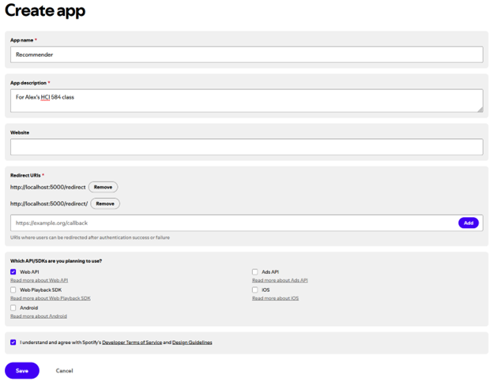
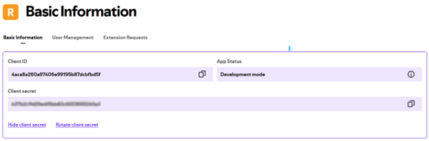
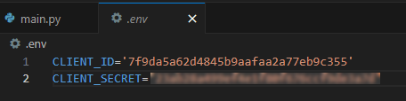
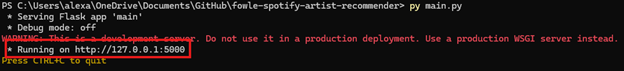
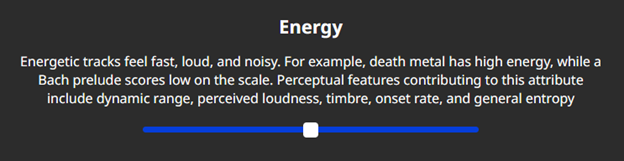
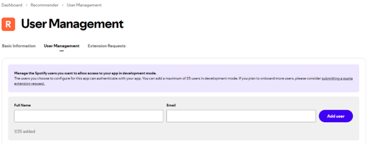

# Spotify Playlist Generator - User guide

The Playlist Generator is a tool that connects to Spotify and allows users to build a playlist based on a set of parameters the user specifies. It is like other recommendation and personalization features in Spotify like Discover Weekly and Daylists, except the Playlist Generator lets you exercise more control over the playlist creation. By selecting from a list of genres and setting audio features, you can create a custom playlist to save in Spotify in a matter of minutes.

This guide walks through app setup, dependency installation, and interface instructions.

For the purpose of this guide, I will assume you’ve already downloaded or cloned this repository on your local machine. I also assume you already have Python 3.X installed.

## Creating the Spotify app

The first step is to create an application in Spotify. This is how the Playlist Generator communicates with Spotify to get your top tracks and save the playlist to Spotify.

1. First, sign in to Spotify for Developers using your normal Spotify credentials: <https://developer.spotify.com/>
2. Click your user profile in the top right of the page, then click “Dashboard”
3. Click the “Create app” button on the top right of the Dashboard page
4. Give the app a name (any name is fine) and a brief description
5. Add the following Redirect URIs:
    - http://localhost:5000/redirect
    - http://localhost:5000/redirect/
6. In “Which API/SDKs are you planning to use?”, select “Web API”
7. Check the checkbox at the bottom to agree to terms, then select “Save” to complete the Spotify app setup

    

## Getting and setting the client ID and client secret

Next, you’ll need to get the client ID and secret of the Spotify app to save in the Flask application.

1. In your Spotify app, click the “Settings” button on the top right of the screen
2. The Client ID is visible at the top of the screen. Click “View client secret” to see the client secret. Make note of these

    

1. In the Flask program, create a file at the root directory named .env (make sure the file has no extension, such as .txt)
2. In .env, enter the following code and replace the values of each with the client ID and secret from your Spotify app:

    

**NOTE:** **Do not share your client secret with anyone.** The reason why these are saved to the .env file is to keep them offline and secure on your computer.

## Installing dependencies

There are two Python libraries that need to be installed on your computer to run the application. In a terminal (shell, terminal, command line, PowerShell terminal, etc.), run the following commands to install the dependencies:

1. `pip install spotipy --upgrade`
2. `pip install flask --upgrade`
3. `pip install flask_session --upgrade`
4. `pip install python-dotenv --upgrade`

## Running the application

The entry point to the application is main.py in the project’s root folder. The Flask application can be started either by running it through an IDE of your choosing or via command line:

1. Open a command line and navigate to the root of the project
2. Enter `py main.py` and press enter on your keyboard to start the application
3. Make note of the following line:

    

This is the URL to access the application. You can enter either this or localhost:5000 into a browser to launch it.

## Using the application

This section describes how to use the application.

1. The first page you’ll see is a Spotify authentication page. This is a necessary step, as it allows the Playlist Generator to communicate with Spotify. Enter your Spotify credentials to authenticate. Then, on the next page, grant the application permissions.
2. On the New or Familiar page, select whether you’d like to listen to New music, which is music you’re not as familiar with, or Familiar music, which is music you already listen to.
3. Next, you’ll see a list of genres. There are a lot; Spotify offers a huge selection of genres for artists to identify with. Select as many genres as you’d like to listen to. Tracks that can be described with the genres you selected will be prioritized for your final playlist. Select the Submit button at the bottom of the page to advance.
4. Next is the Audio Features page. Audio features are the audio characteristics of each track. For each audio feature, a score is assigned to the track; a track might have 85% danceability, for example, and 13% speechiness. These features are set automatically at Spotify, and are therefore somewhat subjective. A full description of audio features is available on [Spotify’s API documentation](https://developer.spotify.com/documentation/web-api/reference/get-audio-features). Use the range sliders to set the desired level of each audio feature; furthest left is 0%, and further right is 100%. For example, if the Energy slider is set to the middle, that means that you would like tracks that have 50% energy:

    

    Tracks that are closer to the values you enter are prioritized for your final playlist. Select the Submit button at the bottom of the page to advance.

5. Congratulations! The next page shows your final playlist. For each track, you’ll see cover art, the track title, track artist(s), and the match percentage. Match % is how closely each track fit the parameters you entered in the application, including genre match and how close the track’s audio features were to the values you entered on the previous page.
6. If you’d like, you can save the playlist to Spotify. To do this, click the “Save to Spotify” button at the bottom of the Playlist page.
7. On the Create Playlist page, enter a name for your playlist, or retain the default value. Click “Save to Spotify” to complete the process.
8. Finally, you’ll get a confirmation page. If all went well, you can start the process over again by clicking the “I want another playlist!” button. If there was an error in saving your playlist, you can try to save the playlist again with the “Try again” button.
9. Enjoy your new playlist in Spotify!

## Use the application with another user

You might want to have someone else use the Playlist Generator on your PC. After all, this is much easier than making someone install all the dependencies, download or clone the project, and create their own Spotify app!

To add new users to your instance of the Playlist Generator app, do the following:

1. First, the Spotify user needs to be added to your Spotify app. Navigate to <https://developer.spotify.com/dashboard> and sign in again, if needed
2. Select your app, then open the App settings by clicking the button at the top right of the screen
3. Tab to the User Management menu in the App setting screen. Enter a name for the new user (this can be anything, and is more for your records than anything) and the email the user uses to sign in to Spotify

    

4. Select “Add user” to authorize the user to use the Playlist Generator on your PC.

Note that, since the application is still in development mode, you can only add a maximum of 25 users. This only applies to your instance of the Spotify app, however; anyone can create their own instance following this guide.

Happy streaming! 🎧🎵✨
 
 
 

# Developer documentation

This section explains how the program works for developers interested in learning more about the backend of the application or for anyone looking to extend the project.

## Overview

The Playlist Generator makes use of Spotify’s excellent Web API, the even more excellent Spotipy library, and Flask pages to gives users a chance to interact with the metadata of Spotify tracks. Spotify offers tons of personalized playlists and recommendation features such as Discover Weekly and AI DJ, but a [known issue](https://portfowleyo.com/spotifyDJ) with these features is that users don’t get the opportunity to exert any control over the process, instead being 100% at the mercy of the algorithm to tell them what they want to listen to. The Playlist Generator addresses this issue by allowing users to instruct the program what types of tracks they want in the playlist it generates, while still relying on Spotify’s built-in recommendations algorithm to mitigate some of the burden.

The app centers around the `track_list` object: a dictionary containing up to 500 Spotify tracks, each with properties such as the `track_id`, audio feature scores (from Spotify), `genres`, `artists`, `album_art`, and more. The input the user provides in the genres and audio features page adjust each track’s `score` property, which is used to select the top 30 tracks (tracks with the highest score at the end of the process earn a spot in the final playlist). `track_list` is passed around in many of the functions both in main.py, which is the page that builds the Flask application, and helper_functions.py, which contains a lot of the supporting logic that mutates the `score` property of each track, among other things.

## User interactions and code flow

The below sub headers describe the action the user takes, followed by the actions the program performs in response.

#### The user starts the application and navigates to localhost:5000

- The helper functions available in helper_functions.py are imported into main.py as `helpers`
- The client ID and secret are imported from .env using `load_dotenv()`
- `home_page()` from main.py fires. The `sp` object is created and the `auth_url` is received from the HTTP response from Spotify
- The user is sent to the authorization URL, then routed back to the `redirect_page()` URL, which extracts the access code from the response and sets the user’s access token
- The user is redirected to `new_or_familiar_page()`
- The GET method invokes `helpers.get_top_tracks()` 10 times to construct the initial `track_list` of the current user’s top 500 tracks of the last year, which is saved in the Flask session
- The `helpers.get_top_tracks()` helper function uses the `current_user_top_tracks()` Spotipy method to return 50 of the current user’s top tracks. It uses the `offset` argument to paginate through results.
- The `GET` method of `new_or_familiar_page()` renders the newOrFamiliar.html template and presents the page in the browser

#### The user selects the “New music” or “Familiar music” button

- The `new_or_familiar_page()` POST method gets the value of the button the user selected (“new” or “familiar”) and passes it to the redirect to `genres_page()`
- The `GET` method of `genres_page()` first checks which option the user selected:
    - If the user selected “familiar”, the original `track_list` is retained
    - If the user selected “new”, `helpers.get_new_tracks()` is invoked. This method uses the `recommendations()` Spotipy method to get automatic recommendations, using the tracks in the original `track_list` as recommendation seeds. 500 new tracks are stored in a new instance of `track_list` and returned to main.py
- `helpers.set_artist_genres()` is invoked to set all genres on all tracks. This function gets the genres of the artist(s) for each track; genres are a property of artists, not tracks. 
    - This is an imperfect system, since artists don’t always create tracks in their own genre, but since genres are largely subjective, it works for the purposes of this program
- `helpers.create_genres_list()` is invoked, which returns a simple list of all genres present in all tracks. This function removes duplicates so that each available genre is presented only once on the genres page
- genres.html is rendered in the browser

#### The user selects which genres they’d like to listen to on the genres page, then selects the “Submit” button

- The `POST` method of `genres_page()` gets the values that the user selected in the genres checkbox list
- `helpers.genre_score_deduction()` fires; this compares the user input to the genres available on each track. If the genres of a track do not match any of the genres the user selected, the track's `score` property is deducted by 20 points (e.g., the score goes from `100.00` to `80.00`). If there is a match, the high score is retained
- An instance of `track_list` with updated scores is returned to main.py and the Flask session is updated
- The user is redirected to `features_page()`
- The `GET` method of `features_page()` invokes `helpers.get_audio_features()` to get and set the audio features on each track. This method makes use of the `audio_features()` Spotipy method to get each of the seven audio features for each track. If a track is missing an audio feature, the feature is set to `None` rather than the floating-point value set by Spotify, and the `missing_audio_features` property is updated to `True`
- The session is updated to an instance of the `track_list` with the audio features set on each track
- features.html is rendered in the browser

#### The user enters values for each audio feature using the range sliders, then selects the “Submit” button

- The `POST` method on `features_page()` gets the user-set value of each range component from features.html
- `helpers.feature_score_deduction()` is invoked, which deduces points from the score property of each track based on the delta between each audio feature value on each track and the value the user submitted. For each audio feature (e.g., `danceability`), the difference between the audio feature’s score from Spotify and the user’s requested value is calculated, normalized to a maximum of `11.0`, and deduced from the track’s `score` property. For example, if there was a perfect match of the track's `danceability` and the user’s requested danceability, `0` will be deduced; if there is a massive difference, `10.7` might be deduced from the track’s `score`
- The session is updated with the `track_list` with updated scores
- The user is redirected to `playlist_page()`
- The `GET` method of the `playlist_page()` invokes `helpers.get_final_playlist()` to get the top 30 tracks to present in the browser.
    - `helpers.get_final_playlist()` first sorts the entire `track_list` based on the score value in descending order, then slices the first 30 tracks and saves it to `top_30_tracks`
    - In `helpers.get_final_playlist()`, `get_album_art()` is invoked which uses the `track()` Spotipy method to get the album art URL for each track and assign it to each track’s `album_art` property. This is then returned and saved to `top_30_tracks_with_album_art`, which is then shuffled (for more intrigue) and returned to main.py as `top_30_tracks`
- `top_30_tracks` is saved to the Flask session
- finalPlaylist.html is rendered in the browser, which displays the tracks from `top_30_tracks`

#### The user selects the “Save to Spotify” button on the playlist page

- The `POST` method on `playlist_page()` saves the `album_art` URLs for the top 4 tracks of `top_30` for rendering in the next page in `top_4_tracks_images`, which is saved to the Flask session
- The user is redirected to `create_playlist_page()`
- The `GET` method on `create_playlist_page()` gets and formats today’s date for display in the next page
- saveToSpotify.html is rendered in the browser. The playlist cover is represented with the album art for the first 4 images, which is how Spotify automatically creates playlist images, and the date is rendered as the playlist name default value

#### The user enters a name for their new playlist and selects the “Save to Spotify” button on the create playlist page

- The `POST` method on `create_playlist_page()` invokes `helpers.create_new_playlist()`, which attempts to save a new public playlist on the Spotify user’s account. It uses the `user_playlist_create()` Spotipy method to create the playlist, then the `user_playlist_add_tracks()` Spotipy method to populate it with the tracks stored in `top_30_tracks`
- If there was no error, `helpers.create_new_playlist()` returns `True`. If there was an error, it returns `False`
- Back in `create_playlist_page()`, the user is redirected to `result_page()`, and the program supplies the outcome of the save operation (“success” or “error”) depending on the return value from `helpers.create_new_playlist()`
- The `GET` method of `result_page()` renders resultsPage.html, which displays a feedback message depending on the result of the save operation. If it was successful, the message reads “Your playlist was successfully added to Spotify!”, and if there was an error, the message reads “Something went wrong. Try again.”
- Depending on the result of the save operation, the button on resultsPage.html renders “I want another playlist!” (if successful) or “Try again” (if there was an error)

#### The user selects the button on the results page

- The `POST` method of `result_page()` redirects to `new_or_familiar_page()` to start the process over again if the button reads “I want another playlist!” OR redirects to `create_playlist_page()` to try the save operation again if the button reads “Try again”

## Known issues

There are a couple of shortcomings of the current version of the Playlist Generator that will be fixed and improved on in future versions:

- The program uses the flask_session library to save the `track_list` and `sp` object (which is the reference to the Spotify API connection), among other things. There’s nothing inherently wrong with using flask_session, except that the current version saves it on the user’s PC in a folder on the root of the project, rather than in a database or on an actual web server. Thus, each time the application is run, *the flask_session folder needs to be deleted from the root directory*, otherwise the program lumps old data (for example, the list of new tracks from a previous run) into data from the current run.
- When using the app with a new user on the same PC, it’s best to do so in a private browsing window. Even after deleting the .cache file (which saves the user’s Spotify access token) and clearing the flask_session, browsers still cache user data, and the program currently has no code for clearing the browser cache.
- There’s currently nothing stopping users from manually entering in route URLs and breaking the application. Route validation is needed.

## Future work

- Update flask_session cache handling to work with a server-hosted database so the app can be deployed globally. Also, create helper functions to hash and store user access tokens in the database.
- Add in code to delete, reconfigure, or ignore browser cache to mitigate access token errors
- Add a login route in the Flask application with a “Sign in to Spotify” button. This page should handle all backend logic for removing cached user information, such as their access token and session properties, if a new user authenticates with the program in the same browser as a previous user.
- Add route validation to include redirects when a user manually navigates to a page prematurely in the process
- Optional: Add some controls so that users can select _how much_ a certain parameter influences the scoring algorithm. For example, rather than having `danceability` hard coded to deduce a maximum of `11.0` points from each track, allow the user to set how many points it maximally deduces/how much `danceability` matters to them.
- Add warnings to the playlist page for when a track was `missing_audio_features`. This is an algorithmic transparency effort to let the user know that the `score`s on those tracks aren’t entirely accurate.
- Improve the website brand and styling.
- Add a UI option to randomize the order of `track_list` before passing it to Spotipy’s `recommendations()` method in `helpers.get_new_tracks()`. Currently, tracks are fed, five at a time, to `recommendations()` in-order from most- to least-streamed of the user’s top 500 tracks. If a user listens to a lot of rock music and less rap, the `track_list` will have an overrepresentation of rock music at the start, meaning that the output of `recommendations()` is likely to reflect and perpetuate one’s tendency to prioritize certain genres while deprioritizing others, resulting in a `track_list` filled with “new” music that might be too similar to the user’s original preferences. Randomizing the order of `track_list` before feeding it to `recommendations()` would result in more interesting new music from seeding each call with a more diverse set of tracks, uninfluenced by the user’s less known listening habits.